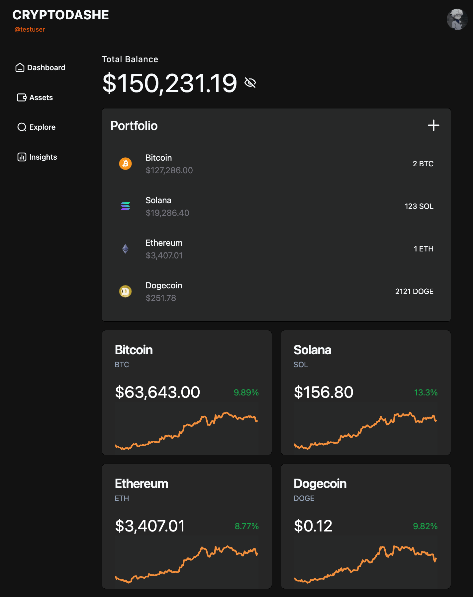
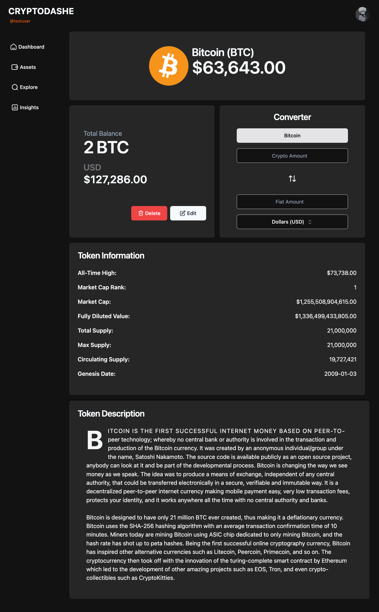
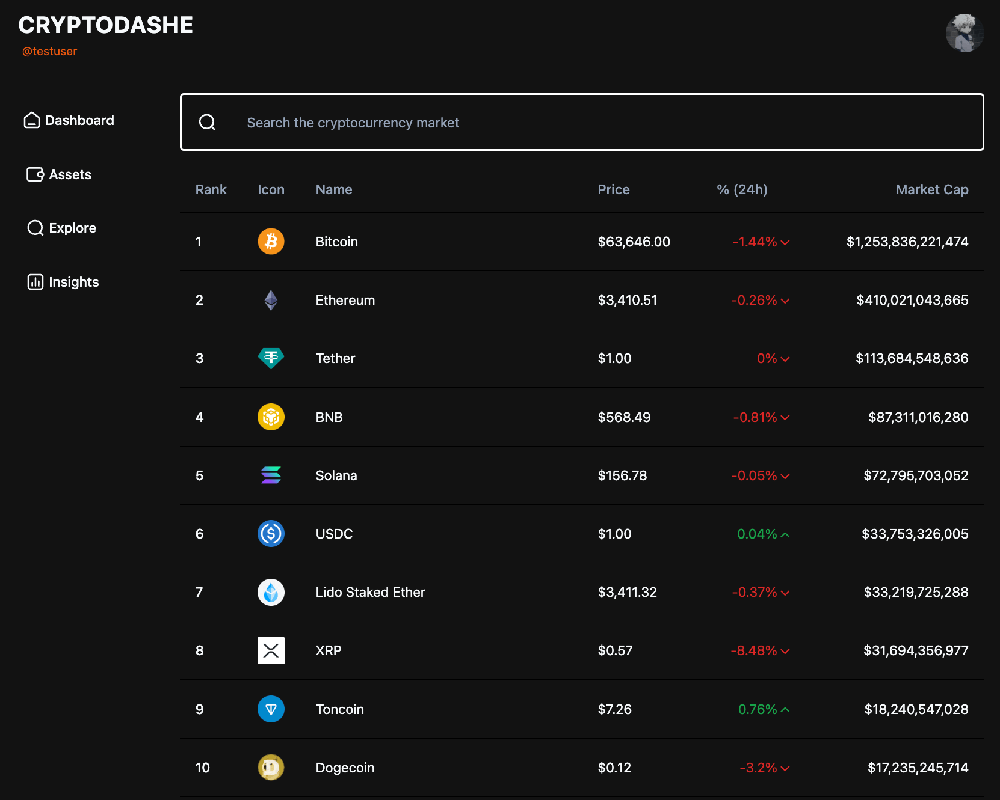
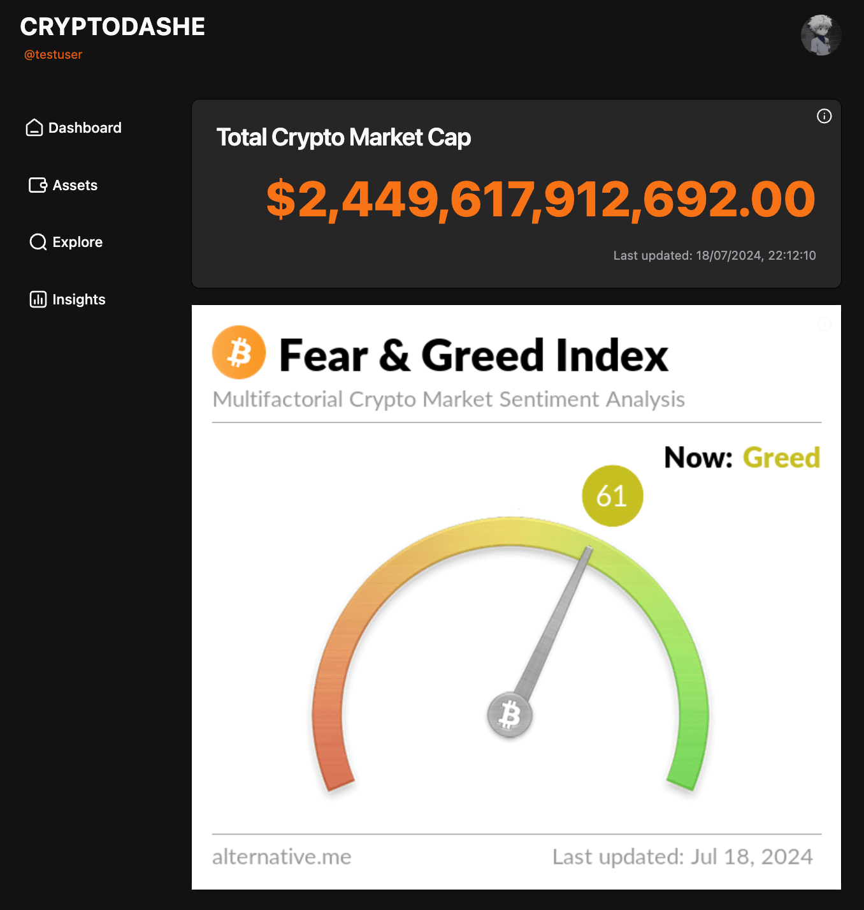

## About

CryptoPortfolio: a cryptocurrency dashboard that offers portfolio tracking with support for over 10,000 tokens.

Built with MERN stack.

## Existing Features

- **Portfolio Tracking**: Monitor your crypto investments
- **Real-time Data**: Up-to-date information on over 10,000 cryptocurrencies
- **Interactive Charts**: Powered by TradingView to help you view your portfolio performance
- **Global Market Information**: Integrated Fear and Greed Index + Global Crypto Market Cap Tracker for a general market insight
- **User-friendly Interface**: Intuitive design for seamless navigation and use
- **Light & Dark Mode**: You decide the look and feel of your Dashboard

## Task

- Develop a public api to return portfolio data of a profile. The api should accept profile name and return portfolio data (balance for each coin, and total balance).

Implement necessary caching mechanism in the api to reduce coingecho api loads

## Installation Instructions

### Prerequisites

- Node.js (v14+ recommended)
- MongoDB
- npm or yarn

### Installation

1. Install dependencies:

- cd cryptoportfolio
- npm install

2. Set up environment variables (create a .env file in the root directory)

#### Frontend (.env file in /client directory)

- VITE_API_BASE_URL = URL of Backend API

#### Backend (.env file in /server directory)

- MONGO_URI= MongoDB URI Connection String
- JWT_ACCESS_SECRET= Your Access Token Secret
- JWT_REFRESH_SECRET= Your Refresh Token Secret
- COINGECKO_API_KEY= Your CoinGecko API Key
- EMAIL_USER= Email Address for Notifications
- EMAIL_PASS= Email App-Specific Password
- ORIGIN_URL= URL of Frontend

3. Start the development server

Navigate to the /client directory and run:

- npm run dev

Navigate to the /api directory and run:

- npm run dev

## App Overview

### Homepage

### Coin Holding

### Explore

### Insights

## Credits

- All coin data is retrieved from the CoinGecko API:
  https://www.coingecko.com/en/api

- Fear and Greed Index Image:
  https://alternative.me/crypto/fear-and-greed-index/#api

- Charts:
  Copyright (с) 2023 TradingView, Inc. https://www.tradingview.com/
